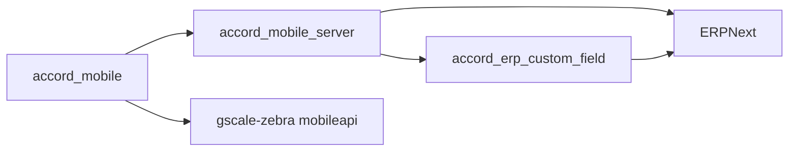

# Accord Mobile

Accord Mobile is the Flutter client for the Accord operational workflow on top
of ERPNext. The app is a presentation and device-integration layer: it renders
role-specific mobile screens, keeps local session and UI state, talks to
`accord_mobile_server`, and leaves business truth and document persistence to
ERPNext.

## System Topology



The normal Accord execution chain is:

`accord_mobile -> accord_mobile_server -> ERPNext`

The GScale mode has a separate local-network execution chain:

`accord_mobile GScale mode -> gscale-zebra mobileapi -> scale / printer / ERPNext`

## Repository Role

This repository owns the user-facing mobile application only.

It is responsible for:

- authentication, re-authentication, logout, and session bootstrap
- role-based navigation and screen composition
- local cache, notification, app-lock, theme, and locale orchestration
- API calls to the mobile backend
- Firebase push registration and local notification display
- Android and iOS device permissions needed by the app
- native iOS back-button and dock bridge integration
- rendering Supplier, Werka, Customer, Admin, and GScale workflows

It does not define business truth. It does not write ERP documents directly. It
does not own ERP field definitions.

## What This Repo Depends On

`accord_mobile` is not standalone in production.

It requires:

- Flutter SDK `>=3.24.0`
- Dart SDK `>=3.5.0 <4.0.0`
- `accord_mobile_server` for the main mobile API
- ERPNext for document persistence and workflow state
- `accord_erp_custom_field` installed in the ERPNext bench so Accord custom
  fields exist on ERP documents
- Firebase configuration for push notifications on Android and iOS
- a reachable backend URL passed through `MOBILE_API_BASE_URL`
- optional GScale LAN service at `gscale.local:39117` or another approved
  `gscale-zebra` mobileapi port

## Runtime Configuration

The main app reads its backend base URL from:

- `MOBILE_API_BASE_URL`

If no value is passed, the app defaults to:

- `https://core.wspace.sbs`

GScale mode reads its default server URL from:

- `API_BASE_URL`

If no GScale value is passed, it defaults to:

- `http://gscale.local:39117`

Preview and QA builds can also use:

- `APP_FORCE_DEVICE_PREVIEW`
- `APP_PREVIEW_ROUTE`
- `APP_PREVIEW_PHONE`
- `APP_PREVIEW_CODE`
- `APP_PREVIEW_BATCH_DISPATCH_DEMO`

## Backend Contract

At runtime the main Accord app expects the backend to expose:

- `GET /healthz`
- endpoints under `/v1/mobile/auth/*`
- profile and push endpoints under `/v1/mobile/profile` and
  `/v1/mobile/push/token`
- Supplier endpoints under `/v1/mobile/supplier/*`
- Werka endpoints under `/v1/mobile/werka/*`
- Customer endpoints under `/v1/mobile/customer/*`
- Admin endpoints under `/v1/mobile/admin/*`
- shared notification endpoints under `/v1/mobile/notifications/*`
- stock-entry barcode lookup under `/v1/mobile/stock-entry/lookup`

When a logged-in session is active, the app checks backend health before
continuing critical flows. If the backend is unavailable, it shows the offline
network gate instead of pretending to work locally.

GScale mode expects a nearby GScale mobileapi server with:

- `GET /healthz`
- `GET /v1/mobile/handshake`
- `GET /v1/mobile/monitor/stream`
- `GET /v1/mobile/monitor/state`
- setup endpoints under `/v1/mobile/setup/*`
- item and warehouse lookup endpoints under `/v1/mobile/items` and
  `/v1/mobile/warehouses`
- batch endpoints under `/v1/mobile/batch/*`
- archive endpoints under `/v1/mobile/archive*`

## Functional Boundaries

### Supplier

Supplier flows cover:

- login and session restore
- item selection and quantity entry
- dispatch confirmation and submission
- summary, history, recent, notification, and detail views
- submitted category and status breakdown pages
- response to unannounced supplier requests

### Werka

Werka flows cover:

- summary, pending queues, and status breakdowns
- supplier receipt confirmation
- customer issue creation
- batch customer issue creation
- unannounced supplier creation
- stock-entry barcode lookup and QR scanning
- archive calendar/list views by sent hub, day, month, year, and period
- archive PDF retrieval, saving, photo extraction, and sharing
- Batch QR parsing and customer issue submission
- notification views
- AI-assisted item search when the backend enables it

Important dispatch behavior:

- stock-entry QR dispatch sends source barcode, stock entry name, and line
  index to the backend so duplicate protection can be enforced server-side
- Batch QR dispatch requires an exact item match before submission
- Batch QR customer selection uses the shared preferred-customer ordering logic

### Customer

Customer flows cover:

- delivery note review
- approve and reject actions
- customer-facing status breakdown and detail pages
- notification views and shared notification detail screens

### Admin

Admin flows cover:

- supplier creation, detail, item assignment, inactive supplier restore/removal
- customer creation, detail, code regeneration, item assignment, and removal
- item creation and item group bulk move
- Werka/admin module access
- operational settings and activity review

### GScale

GScale mode is available from Werka/Admin navigation and embeds the GScale
operator app inside the main Flutter application.

GScale flows cover:

- LAN server discovery using `gscale.local`, cached servers, direct probes, and
  approved mobileapi ports
- server health, handshake, and live monitor stream
- ERP setup status and ERP setup submission/removal
- item and warehouse lookup
- scale/manual batch start and stop
- manual print requests
- Zebra/Godex printer mode selection
- archive listing and archive print requests
- local draft persistence for operator control settings

## Data And State Model

The app stores local session and UI state only.

Important local concerns:

- auth token, last phone, and last code persistence in `SharedPreferences`
- automatic re-authentication after a `401` when stored credentials are present
- unread and hidden notification state
- runtime stores for Supplier, Werka, and Customer delivery state
- search activity history and search normalization
- PIN, biometric, theme, and locale preferences
- profile avatar cache and runtime reset behavior
- cached GScale servers and operator-control drafts

Important ERP-facing concerns are not owned here:

- `Delivery Note` state
- `accord_flow_state`
- `accord_customer_state`
- `accord_customer_reason`
- `accord_delivery_actor`
- `accord_status_section`
- `accord_ui_status`

## Device Features

Android permissions include:

- internet access
- camera access for QR scanning and AI-assisted item search images
- biometric authentication
- push notification posting
- legacy external storage write support up to Android API 29

iOS configuration includes:

- Face ID usage text for app unlock
- camera usage text for photo/search flows
- photo library usage text for archive page saving
- remote notification registration
- native scene integration for back navigation and bottom dock behavior

## Localization And UI Runtime

The app supports:

- Uzbek
- English
- Russian

Startup loads the native bridge, local notifications, session, unread
notifications, security settings, theme, locale, and platform helper before the
app shell is rendered. The main shell wraps routes with app lock, notification
runtime, network requirement checks, and dock gesture handling.

## Build And Run

Install dependencies:

```bash
flutter pub get
```

Run against a local backend:

```bash
make run-local
```

Run web against a local backend:

```bash
make web-local
```

Run against the public/domain backend:

```bash
make run-domain
```

Run with a custom backend:

```bash
make run API_URL=https://example.com
```

Build a release APK for the public/domain backend:

```bash
make apk-domain
```

Build a release APK with a custom backend:

```bash
make apk API_URL=https://example.com APK_NAME=accord.apk
```

Release APK builds are arm64-v8a only by design.

## Make Targets

Common app targets:

- `make deps`
- `make run`
- `make run-local`
- `make web`
- `make web-local`
- `make run-domain`
- `make apk`
- `make apk-domain`
- `make analyze`
- `make test`

Backend/runtime helpers:

- `make backend-up`
- `make backend-stop`
- `make core-up`
- `make core-stop`
- `make remote-up`
- `make remote-stop`
- `make remote-url`
- `make domain-up`
- `make domain-up-fast`
- `make domain-url`

ERP bench helpers:

- `make bench-start`
- `make bench-restart`
- `make bench-stop`
- `make bench-limit-start`
- `make bench-limit-stop`

Android setup:

- `make android-sdk-setup`

## iOS Device Install

Use the runbook when fresh-installing on a physical iPhone:

- `docs/runbooks/ios_device_install_runbook.md`

The documented path uses a signed `profile` build because Flutter debug builds
do not behave like normal home-screen apps on iOS. The iOS project also includes
native asset framework re-signing for physical device installs.

## File Map

Core app entry points:

- `lib/main.dart`
- `lib/src/app/app.dart`
- `lib/src/app/app_router.dart`
- `lib/src/core/api/mobile_api.dart`
- `lib/src/core/network/network_requirement_runtime.dart`
- `lib/src/core/notifications/service/push_messaging_service.dart`

Core runtime areas:

- `lib/src/core/session/`
- `lib/src/core/security/`
- `lib/src/core/notifications/`
- `lib/src/core/search/`
- `lib/src/core/files/`
- `lib/src/core/localization/`
- `lib/src/core/theme/`
- `lib/src/core/widgets/`

Feature areas:

- `lib/src/features/auth/`
- `lib/src/features/supplier/`
- `lib/src/features/werka/`
- `lib/src/features/customer/`
- `lib/src/features/admin/`
- `lib/src/features/gscale/`
- `lib/src/features/shared/`

Operational helpers:

- `docs/runbooks/ios_device_install_runbook.md`
- `docs/bug-hunt-findings.md`
- `tools/bootstrap/setup_android_sdk.sh`
- `tools/bootstrap/ensure_core.sh`
- `tools/bootstrap/ensure_mobileapi.sh`
- `tools/runtime/run_linux_preview.sh`
- `tools/runtime/start_domain_core.sh`
- `tools/runtime/start_remote_core.sh`
- `tools/runtime/stop_remote_core.sh`

## Tests And Checks

Run static analysis:

```bash
make analyze
```

Run the Flutter test suite:

```bash
make test
```

The app-owned analyzer config excludes `third_party/**` so vendored plugin code
does not pollute app analysis.

Focused test coverage currently includes:

- app navigation and retry state
- native top-bar and bottom-nav behavior
- admin supplier/customer/item workflows
- customer delivery runtime and priority behavior
- Supplier confirm flow
- Werka archive, Batch QR, create hub, runtime store, and stock-entry lookup
- search normalization and search activity persistence
- shared confirmation dialog and scroll physics

## Related Repositories

- Mobile backend: `accord_mobile_server`
- ERP custom field app: `accord_erp_custom_field`
- GScale mobileapi: `gscale-zebra`

## Operational Notes

- Use a public/domain backend for release builds, never `localhost` or
  `127.0.0.1`.
- Keep business logic in `accord_mobile_server`, GScale mobileapi, and ERPNext,
  not in this Flutter client.
- Generated logs, pid files, tunnel state, and scratch output live in
  `garbage/`.
- Keep `third_party/local_auth_darwin` vendored and excluded from app analysis.
- If a field, endpoint, route, or device permission changes, update this README
  together with the backend and ERP app README files.
