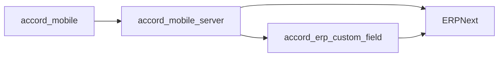

# Accord Mobile

Accord Mobile is the Flutter client for the Accord operational workflow on top of ERPNext. It is a thin presentation layer: it renders role-specific screens, manages local session state, and delegates business truth to `accord_mobile_server`, which in turn delegates persistence and document state to ERPNext.

## System Topology



The practical execution chain is:

`accord_mobile -> accord_mobile_server -> ERPNext`

## Repository Role

This repository owns the user-facing application only.

It is responsible for:

- authentication and session bootstrap
- role-based navigation and screen composition
- local cache, notification, and app-lock orchestration
- API calls to the mobile backend
- rendering Supplier, Werka, Customer, and Admin flows

It does not define business truth. It does not write ERP documents directly. It does not own ERP field definitions.

## What This Repo Depends On

`accord_mobile` is not standalone in production.

It requires:

- `accord_mobile_server` for all mobile API endpoints
- ERPNext for document persistence and workflow state
- `accord_erp_custom_field` installed in the ERPNext bench so `Delivery Note` custom fields exist
- Firebase configuration for push notifications on Android and iOS
- a reachable backend URL passed as `MOBILE_API_BASE_URL`

## Runtime Contract

The app reads its backend base URL from:

- `MOBILE_API_BASE_URL`

If no value is passed, the app defaults to:

- `https://core.wspace.sbs`

At runtime the app expects the backend to expose:

- `GET /healthz`
- authentication endpoints under `/v1/mobile/auth/*`
- role endpoints under `/v1/mobile/supplier/*`, `/v1/mobile/werka/*`, `/v1/mobile/customer/*`, and `/v1/mobile/admin/*`

When a logged-in session is active, the app checks backend health before continuing critical flows. If the backend is unavailable, it shows the offline network gate instead of pretending to work locally.

## Functional Boundaries

### Supplier

Supplier flows cover:

- login and session restore
- item selection and dispatch submission
- summary, history, and notification views
- state breakdown and detail pages

### Werka

Werka flows cover:

- summary and pending queues
- supplier receipt confirmation
- customer issue creation
- batch customer issue creation
- archive and detail views
- AI-assisted item search when the backend enables it

### Customer

Customer flows cover:

- delivery note review
- approve and reject actions
- customer-facing status breakdown
- discussion and notification views

### Admin

Admin flows cover:

- supplier management
- customer management
- item assignment
- operational configuration
- activity review

## Data And State Model

The app stores only local session and UI state.

Important local concerns:

- token and profile persistence in `SharedPreferences`
- unread and hidden notification state
- search activity history
- lock and security preferences
- avatar cache and runtime reset behavior

Important ERP-facing concerns are not owned here:

- `Delivery Note` state
- `accord_flow_state`
- `accord_customer_state`
- `accord_customer_reason`
- `accord_delivery_actor`
- `accord_status_section`
- `accord_ui_status`

## Build And Run

### Local development

```bash
flutter pub get
make run-local
```

### Run against a public backend

```bash
make run-domain
```

### Build a release APK

```bash
make apk-domain
```

## Configuration

The project expects the following external setup:

- `android/app/google-services.json` for Firebase on Android
- optional iOS Firebase config when building iOS artifacts
- a valid backend URL through `MOBILE_API_BASE_URL`
- an online backend that can authenticate against ERPNext

## File Map

Core entry points:

- `lib/main.dart`
- `lib/src/app/app.dart`
- `lib/src/app/app_router.dart`
- `lib/src/core/api/mobile_api.dart`
- `lib/src/core/network/network_requirement_runtime.dart`
- `lib/src/core/notifications/push_messaging_service.dart`

## Related Repositories

- Mobile backend: [accord_mobile_server](https://github.com/WIKKIwk/accord_mobile_server)
- ERP custom field app: [accord_erp_custom_field](https://github.com/WIKKIwk/accord_erp_custom_field)

## Operational Notes

- Use the public backend for release builds, never `localhost` or `127.0.0.1`
- Keep business logic in `accord_mobile_server` and ERPNext, not in the client
- If a field or endpoint changes, update this README together with the backend and ERP app README files

